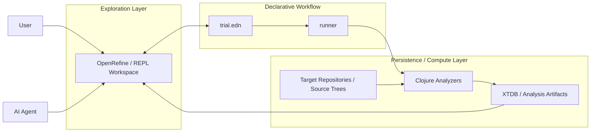

# OpenRefine Workbench

> Human REPL と AI Agent が同じ操作面を共有する、汎用データ/コード解析ワークベンチ。
> JavaParser + XTDB v2 による Java コードベース静的解析と、GitHub Models API を使った **AI テスト増幅**。

---

## 概要

2 層構成のワークベンチです。

| 層 | ツール | 役割 |
|---|---|---|
| **探索層** | OpenRefine | messy data を GUI で手探り。試行は trial 単位で管理 |
| **永続層** | XTDB v2 | ingest → query → visualize のループを Clojure REPL / AI Agent で操作 |

どちらの層も `trial.edn` をセッション記述子として共有し、再現可能な分析を目指します。



このワークベンチでは、`trial.edn` を起点に、対象リポジトリの解析結果を XTDB に蓄積し、OpenRefine と AI Agent を通じて探索と再試行を反復します。

OpenRefine と XTDB を使ったスライシングの具体的な進め方や役割分担については [docs/openrefine-xtdb-slicing-direction.md](docs/openrefine-xtdb-slicing-direction.md) を参照してください。上の全体図を、スライシング用途に寄せて具体化した補助ドキュメントです。

### 主要な分析能力

- **Java コード解析** (`jref!` / `jsig!` / `sqlref!`)
  - 呼び出しグラフ（call graph）を AST から抽出
  - メソッドシグネチャ（型・修飾子）を解析
  - MyBatis SQL アノテーション（`@Select` / `@Param` など）を抽出

- **JaCoCo カバレッジ統合** (`jacoco!`)
  - ビルド結果の `jacoco.xml` を XTDB に同期（差分更新・冪等）
  - 「未テスト」メソッドを自動特定
  - カバレッジ増幅の効果を定量化

- **AI テスト生成・修正** (`gen-tests-uncovered` / `fix-bucket!`)
  - 未カバーかつ SQL 縛り付きメソッドのテストスケルトン生成（GitHub Models API）
  - 生成テストのコンパイルエラーを自動修正（AI 修正 + javac 検証）
  - runner フェーズ化で modify → check → modify サイクルの自動化

---

## 設計方針

**最小 3 ステップの REPL ループ**

```
ingest → query → visualize
```

**Human REPL と AI Agent が同じ操作面を使う**

```clojure
(require '[workbench.core :as core])

(core/start!)                          ; デフォルト: .xtdb/ に永続化
(core/ingest! "src")                   ; ファイルツリー → :files テーブル
(core/xref!   ["src"])                 ; Clojure xref  → :refs テーブル
(core/xref!   ["src"] :trial "t1")    ; trial スコープ付きで同期
(core/jref!   ["trials/samples/repo"]) ; Java xref     → :refs テーブル
(core/tree)                            ; ツリー表示
(core/q '(from :refs [*]))             ; 任意クエリ
(core/stop!)
```

---

## AI テスト増幅ワークフロー

テストなし or 低カバレッジのメソッドに対し、**AI 生成スケルトン → 修正 → カバレッジ再計測** のサイクルを自動化します。

### ワークフロー概要

```
1. データ投入（jref! + jacoco! + sqlref!）
   ↓
2. 未カバー × SQL 縛り候補を特定（uncovered-sql-methods）
   ↓
3. スケルトン一括生成（gen-tests-uncovered）→ exports/gen-tests/*.md
   ↓
4. md を統合して Test.java に（merge-all-test-mds）
   ↓
5. コンパイルエラー検出・修正（:testfix/fix-bucket フェーズ）
   ├─ AI で型不一致・存在しないメソッド等を修正
   └─ javac で再検証
   ↓
6. mvn test → jacoco.xml 生成
   ↓
7. jacoco! で差分更新 → 繰り返し（カバレッジ増幅）
```

### REPL 例

```clojure
;; 1. データ投入（trial スコープ付き）
(core/jref! ["trials/experiments/tradehub/repo"] :trial "tradehub")
(core/sqlref! ["trials/experiments/tradehub/repo"] :trial "tradehub")
(core/jsig! ["trials/experiments/tradehub/repo"] :trial "tradehub")
(core/jacoco! "path/to/jacoco.xml" :trial "tradehub")

;; 2. 候補確認
(core/uncovered-sql-methods :trial "tradehub")
;; => [{:class "DocumentAggregateServiceImpl" :method "resolveProcessId" ...} ...]

;; 3. スケルトン生成
(core/gen-tests-uncovered :trial "tradehub"
                          :out-dir "trials/experiments/tradehub/exports/gen-tests")

;; 4. Test.java に統合
(core/merge-all-test-mds :trial "tradehub"
                         :gen-dir "trials/experiments/tradehub/exports/gen-tests"
                         :dest-dir "trials/experiments/tradehub/repo/.../src/test/java")

;; 5. テスト修正フェーズ（runner で自動実行、またはREPLから手動実行）
(core/fix-bucket!
  "path/to/DocumentAggregateServiceImplTest.java"
  :trial "tradehub"
  :class-name "DocumentAggregateServiceImpl"
  :src-root "trials/experiments/tradehub/repo/.../src/main/java"
  :bucket-index 0
  :classpath-file "/tmp/tradehub-gen-tests.classpath")
```

**詳細は [docs/test-amplification.md](docs/test-amplification.md) を参照。**

---

## Trial ワークフロー & Runner フェーズ

`trial.edn` は複数の分析ステップを **フェーズ** として管理できます。  
各フェーズは XTDB に記録され、再実行時に自動スキップされます。

### trial.edn 構成例

```edn
{:trial/id "2026-04-28-tradehub"
 :trial/tool :xtdb-workbench
 
 ;; Maven classpath 自動生成（testfix フェーズが使用）
 :maven/classpath-config
 {:repo-root "trials/experiments/2026-04-28-tradehub/repo"
  :module "common-lib"
  :scope "test"
  :output-file "/tmp/tradehub-common-lib-gen-tests.classpath"}

 ;; フェーズパイプライン
 :phases [
  {:phase :ingest/jref :params {:paths ["repo"]}}
  {:phase :ingest/jacoco :params {:module-dir "repo/common-lib"}}
  {:phase :ingest/sqlref :params {:paths ["repo"]}}
  
  {:phase :generate/tests :params {:trial "tradehub"}}
  {:phase :generate/merge-tests :params {...}}
  
  ;; ✨ テスト修正フェーズ（Phase 1-2 の成果）
  {:phase :testfix/fix-bucket
   :params {:java-path "exports/gen-tests/DocumentAggregateServiceImpl/Test.java"
            :class-name "DocumentAggregateServiceImpl"
            :src-root "repo/common-lib/src/main/java"
            :bucket-index 0
            :classpath-file "/tmp/tradehub-common-lib-gen-tests.classpath"}}
 ]}
```

**bin/run-trial** でフェーズパイプラインを自動実行。PC リブート後も同じ configuration で継続可能。

**詳細は [docs/trial.md](docs/trial.md) を参照。**

---

## ディレクトリ構成

```
.
├── bin/
│   ├── analyze                # コード解析ショートカット（1コマンド完結）
│   ├── init-trial             # trial.edn スケルトン生成
│   ├── run-trial              # OpenRefine trial 実行
│   └── start-openrefine.ps1   # Windows 用 OpenRefine 起動スクリプト
├── src/
│   ├── openrefine_runner.clj  # OpenRefine API クライアント
│   └── workbench/
│       ├── analyze_template.clj  # 分析フェーズ 1〜10 のテンプレートスクリプト
│       ├── core.clj              # REPL / AI Agent 統合エントリポイント
│       ├── codegen.clj           # GitHub Models API クライアント（gen-test）
│       ├── ingest.clj            # dir! / xref! / cochange! — XTDB への取り込み
│       ├── jacoco.clj            # jacoco! / jacocos — JaCoCo XML 取り込み
│       ├── jref.clj              # jref! / jsig! — Java xref + シグネチャ解析
│       ├── query.clj             # q      — XTDB クエリ薄ラッパー
│       ├── sqlref.clj            # sqlref! / sqlrefs — MyBatis SQL 解析
│       └── visualize.clj         # tree / call-tree / gexf — 結果の可視化
├── test/
│   └── smoke_test.clj
├── docs/
│   ├── analysis.md            # Java/Clojure 解析 end-to-end・クエリ例
│   ├── api.md                 # workbench.core API・スキーマ詳細
│   ├── openrefine-xtdb-slicing-direction.md # OpenRefine × XTDB スライシング方向性メモ
│   ├── test-amplification.md  # テスト増幅ワークフローガイド（生成・統合・修正・カバレッジ計測）
│   ├── trial.md               # Trial ワークフロー詳細
│   └── setup.md               # 環境セットアップ詳細
├── manifest.scm               # Guix 環境定義（推奨実行環境）
├── deps.edn                   # Clojure 依存定義
└── trials/
    ├── samples/               # 公開可能なサンプル trial
    └── experiments/           # ローカル作業用（.gitignore で除外）
```

---

## クイックスタート

### A. XTDB ワークベンチ（Clojure REPL）

```bash
# Guix 環境で nREPL 起動
guix shell -m manifest.scm -- clojure -M:xtdb:repl
```

```clojure
(require '[workbench.core :as core])

(core/start!)                          ; デフォルト: .xtdb/ に永続化
(core/ingest! "src")                   ; => 5
(core/xref!   ["src"])                 ; => 500（Clojure xref）
(core/xref!   ["src"] :trial "t1")    ; trial スコープ付きで同期
(core/jref!   ["trials/samples/repo"]) ; => 1（Java xref）
(core/tree)
(core/q '(from :refs [*] (limit 3)))

;; メトリクス
(core/fan-out)                     ; 依存数降順
(core/fan-in)                      ; 被依存数降順
(core/hotspots)                    ; fan-in 上位 10
(core/hotspots 5)                  ; 上位 5

;; AI テスト生成（GitHub Models API 使用）
(core/jsig! ["trials/experiments/xxx/repo"] :trial "my-project")
(core/jacoco! "/path/to/jacoco.xml" :trial "my-project")
(core/sqlref! ["trials/experiments/xxx/repo"] :trial "my-project")

;; 生成対象を確認
(core/uncovered-sql-methods :trial "my-project")
;; => [{:class "FooServiceImpl" :method "doSomething" :sql-deps [...]} ...]

;; スケルトン生成・統合
(core/gen-tests-uncovered :trial "my-project" 
                          :out-dir "trials/experiments/xxx/exports/gen-tests")
(core/merge-all-test-mds :trial "my-project" 
                         :gen-dir "trials/experiments/xxx/exports/gen-tests"
                         :dest-dir "trials/experiments/xxx/repo/.../src/test/java")

;; テスト修正（AI で compile errors を自動修正）
(core/fix-bucket!
  "path/to/FooServiceImplTest.java"
  :trial "my-project"
  :class-name "FooServiceImpl"
  :src-root "trials/experiments/xxx/repo/.../src/main/java"
  :bucket-index 0
  :classpath-file "/tmp/my-classpath.classpath")

(core/stop!)
```

**`bin/analyze` — 1 コマンド完結**

```bash
# Clojure + Java 両方を解析（デフォルト）
bin/analyze src/

# trial スコープ付き・Java のみ・hotspots 上位 5
bin/analyze trials/samples/repo --trial my-trial --lang java --top 5
```

smoke test:

```bash
guix shell -m manifest.scm -- clojure -A:xtdb -M test/smoke_test.clj trials/samples/repo
```

### B. OpenRefine trial（GUI 探索）

```bash
# trial を初期化
./bin/init-trial --trial-id "my-analysis" --pattern "*.java"

# trial を実行（runner フェーズ自動実行・classpath 自動生成含む）
./bin/run-trial trials/experiments/my-analysis/trial.edn

# サンプルを実行
./bin/run-trial trials/samples/test-csv-import/trial.edn
```

### JaCoCo 取り込み（`:ingest/jacoco`）の実行ルール

`run-trial` の `:xtdb-workbench` フェーズで `:ingest/jacoco` を使う場合、
`trial.edn` の `:params` は次のどちらかを指定します。

- `:jacoco-xml` — 既存の `jacoco.xml` をそのまま取り込む
- `:module-dir` — Maven 実行で `target/site/jacoco/jacoco.xml` を生成して取り込む

`module-dir` 指定時は、内部的に次の流れで実行します。

- `test org.jacoco:jacoco-maven-plugin:report`
- `-Dmaven.test.failure.ignore=true` を付与（テスト失敗があってもレポート生成を継続しやすくする）
- 生成後に `target/site/jacoco/jacoco.xml` が存在すれば取り込みを続行

`jacoco.exec` が残っている場合は、後から `jacoco:report` 相当を実行して
`jacoco.xml` を再生成できます。

---

## ドキュメント

| ドキュメント | 内容 |
|---|---|
| [docs/test-amplification.md](docs/test-amplification.md) | **テスト増幅ワークフロー完全ガイド** — テストスケルトン生成 → 統合 → AI 修正 → カバレッジ計測の全工程。修正フェーズ（`:testfix/fix-bucket`）の trial.edn 統合例も含む |
| [docs/trial.md](docs/trial.md) | Trial ワークフロー・trial.edn スキーマ・runner フェーズ機構・`:maven/classpath-config` による自動化 |
| [docs/api.md](docs/api.md) | workbench.core API リファレンス・テーブルスキーマ・`fix-bucket!` の使用方法（REPL / runner 両対応）・XTDB の落とし穴 |
| [docs/analysis.md](docs/analysis.md) | Java/Clojure 解析 end-to-end・複雑なクエリ例・静的解析の限界 |
| [docs/openrefine-xtdb-slicing-direction.md](docs/openrefine-xtdb-slicing-direction.md) | OpenRefine にソースと XTDB の分析結果をどう持ち込み、スライシングや変更影響分析へつなぐかの方向性メモ |
| [docs/setup.md](docs/setup.md) | 環境セットアップ詳細・orcli・OpenRefine Windows 起動・WSL 接続 |

---

## 実装状況

### XTDB ワークベンチ

| 機能 | 状態 |
|---|---|
| `ingest!` — ファイルツリー → `:files` | ✅ |
| `xref!` — Clojure cross-reference → `:refs` | ✅ |
| `jref!` — Java cross-reference → `:refs`（JavaParser） | ✅ |
| `jrefs` — Java xref クエリ（ノイズフィルタ・試験スコープ・exclude-test） | ✅ |
| `jsig!` / `jsigs` — Java メソッドシグネチャ → `:jsigs`（型付き） | ✅ |
| `sqlref!` / `sqlrefs` — MyBatis SQL アノテーション → `:sql-refs` | ✅ |
| `jacoco!` / `jacocos` / `coverage` — JaCoCo XML → `:jacoco` | ✅ |
| `cochange!` / `cochanges` — Git 共変更履歴 → `:cochanges` | ✅ |
| `q` — XTQL クエリ | ✅ |
| `tree` / `tree-str` — ツリー表示 | ✅ |
| `refs` / `jrefs` — 呼び出しグラフ（Clojure / Java、ノイズフィルタ付き） | ✅ |
| `call-tree` / `call-tree-str` — 呼び出し木表示 | ✅ |
| `topo-sort` — クラス依存順トポロジカルソート（切り出し順推定） | ✅ |
| `fan-out` / `fan-in` / `hotspots` — 依存メトリクス | ✅ |
| `impact` / `deps` / `neighborhood` — ピンポイント影響分析 | ✅ |
| `sql-impact` / `sql-impact-report` / `sql-impact-report-multi` — SQL 縛り影響分析 | ✅ |
| `sql-cochange-check` — 静的解析 × git 履歴 照合 | ✅ |
| `export-gexf!` — GEXF エクスポート（Gephi / Cytoscape 連携） | ✅ |
| `export-graphml!` — GraphML エクスポート（Cytoscape 向け） | ✅ |
| `export-cytoscape-csv!` — Cytoscape CSV エクスポート（GraphML 代替） | ✅ |
| `bin/analyze` — 解析ショートカット CLI | ✅ |
| `test-context` — クラス/メソッドのテスト生成コンテキスト構築 | ✅ |
| `gen-test` — GitHub Models API 経由 JUnit 5 テスト生成 | ✅ |
| `uncovered-sql-methods` — 未カバー × SQL 縛りメソッド一覧 | ✅ |
| `gen-tests-uncovered` — 候補全件の一括テスト生成 | ✅ |
| `merge-all-test-mds` — per-method md を統合して Test.java を生成 | ✅ |
| `fix-bucket!` — テスト修正フェーズ（AI 修正 + コンパイル検証）— runner `:testfix/fix-bucket` フェーズとして実行可能 | ✅ |
| `bin/setup-classpath` — Maven classpath 自動生成（trial.edn `:maven/classpath-config` から） | ✅ |

---

## Phase 1-2 の成果：AI テスト修正の runner 統合

**Phase 1（refactor）**: `fix-bucket!` を workbench.core に統合、`:testfix/fix-bucket` フェーズとして runner で実行可能に。  
**Phase 2（testing）**: 実装検証完了。DocumentAggregateServiceImplTest が D-rank（3 コンパイルエラー）から B-rank（エラー 0）に昇格。

### 新しい機能

| 機能 | 説明 | 導入 | Commit |
|---|---|---|---|
| **fix-bucket! 関数** | クラス単位・バケット単位でコンパイルエラーを修正（AI + javac 検証） | Phase 1 | 63d4ed7 |
| **:testfix/fix-bucket フェーズ** | runner パイプラインに統合可能。trial.edn で宣言的に指定 | Phase 1 | 63d4ed7 |
| **setup-classpath** | trial.edn の `:maven/classpath-config` から Maven classpath を自動生成 | Phase 2 | 13273ae |
| **:maven/classpath-config** | trial.edn で classpath 生成ルールを宣言。PC リブート後も自動再生成 | Phase 2 | 13273ae |

### 使用例（trial.edn）

```edn
{:trial/id "2026-04-28-tradehub"
 
 :maven/classpath-config
 {:repo-root "trials/experiments/2026-04-28-tradehub/repo"
  :module "common-lib"
  :scope "test"
  :output-file "/tmp/tradehub-common-lib-gen-tests.classpath"}
 
 :phases [
  ;; ... 前のフェーズ ...
  
  {:phase :testfix/fix-bucket
   :params {:java-path "exports/gen-tests/DocumentAggregateServiceImpl/DocumentAggregateServiceImplTest.java"
            :class-name "DocumentAggregateServiceImpl"
            :src-root "repo/common-lib/src/main/java"
            :bucket-index 0
            :classpath-file "/tmp/tradehub-common-lib-gen-tests.classpath"}}
 ]}
```

`bin/run-trial` 実行時：
1. `setup-classpath` が自動実行 → `/tmp/tradehub-common-lib-gen-tests.classpath` 生成
2. 各フェーズが順序実行
3. `:testfix/fix-bucket` 到達時に AI でコンパイルエラー修正
4. XTDB が修正済みフェーズを記録 → 再実行時にスキップ

**詳細は [docs/test-amplification.md](docs/test-amplification.md#テスト修正フェーズtestfixfix-bucket) の「テスト修正フェーズ」セクションを参照。**

---

### OpenRefine trial ワークフロー

| 機能 | 状態 |
|---|---|
| `run-trial` — project 自動作成 + ブラウザ起動 | ✅ |
| `orcli transform` — seed-history 自動適用 | ✅ |
| `orcli export` — TSV/CSV 出力 | ✅ |
| `init-trial` — trial.edn スケルトン生成 | ✅ |
